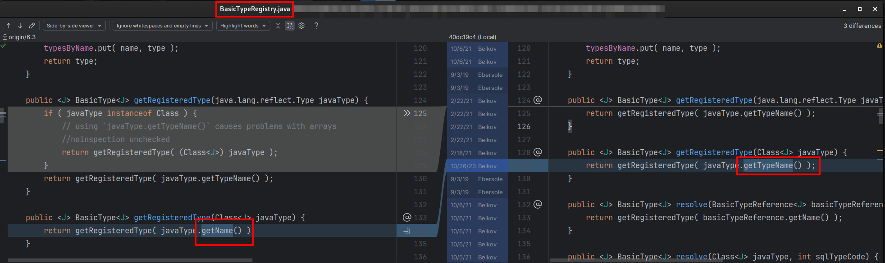
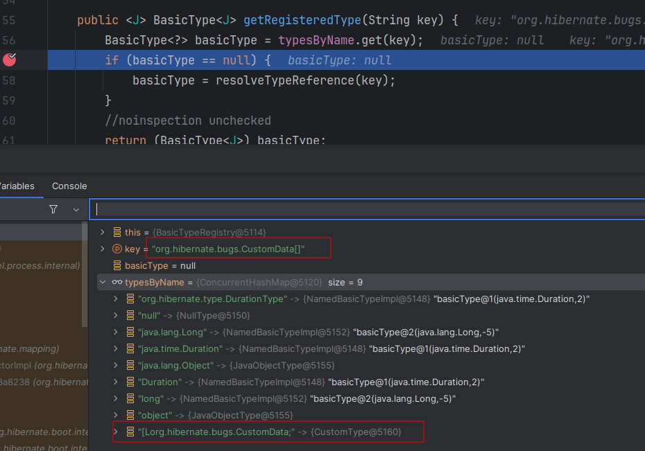

# Hibernate test case reproducing a problem with not recognised custom `UserType`

## Forum

Problem was discussed on
the [Hibernate forum](https://discourse.hibernate.org/t/usertype-not-recognised-in-version-6-5-x/10534).
You can see the details there.

## Problem

The problem occurred in the version `6.4.0.Final` (and all newer versions have the same problem).
It was running just fine in the version `6.3.2.Final` as this test case proves.

Problem occurred with
this [commit](https://github.com/hibernate/hibernate-orm/commit/bfb9fcc0f6e2e273447af61818126e9816d4b50f#diff-6e57fbb54ce7701fb6c96daa61f4c99aa2814bcc681b97ec25db0eaf555ab46e)
inside the `BasicTypeRegistry` class.




It's the problem with array properties
```java
@Entity
public class SomeEntity {
    @Column
    private CustomData[] customData;
```

Even though a custom `UserType` exists for the given type, it's properly registered in `TypeContributor` and
the contributor is properly registred inside the `META-INF/services/org.hibernate.boot.model.TypeContributor`.

The problem lies in the difference between values produced for array types by
```java
javaType.getName() // produces "[Lorg.hibernate.bugs.CustomData"
```
and 
```java
javaType.getTypeName() // produces "org.hibernate.bugs.CustomData[]"
``` 

The custom type is still registered with the value `[Lorg.hibernate.bugs.CustomData` but it's being
found as `org.hibernate.bugs.CustomData[]`



## Test case

Just run the test case `UserTypeNotRecognisedTestCase`. If the version is changed back to `6.3.2.Final` the very
same test case works just fine.

